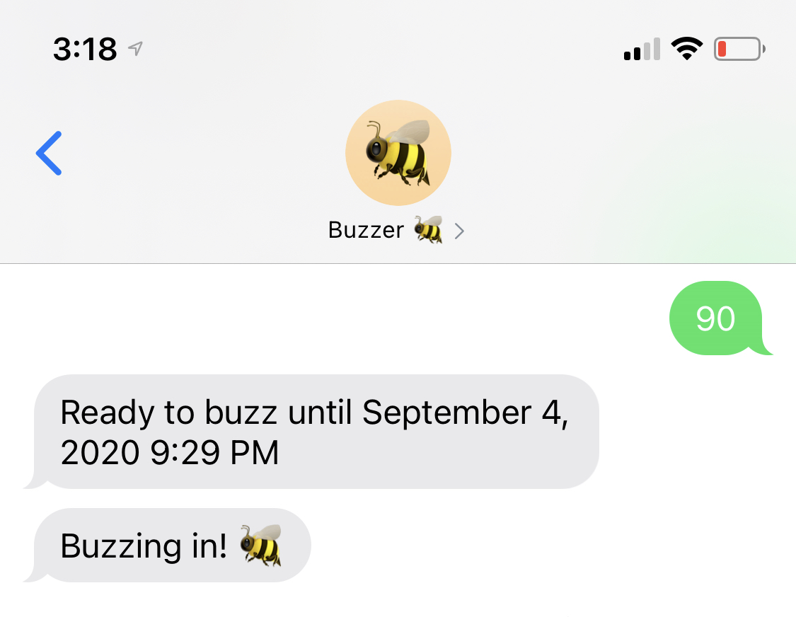

# Bumblebee 🐝

 

Have one of those directories in your building that calls your phone to buzz people in? Too lazy to answer the phone and press 9 everytime you need to let someone in? Now Bumblebee can take care of that for you! Using Twilio and Azure Functions, you can text the Twilio number to set time periods that Bumblebee should automatically buzz people in. Any calls when Bumblebee is not active will automatically forward to your phone.

Inspired by [https://github.com/mulka/buzzer](https://github.com/mulka/buzzer), I wanted to build something similar myself using some services that I was interested in giving a try.

## Getting Started 🎬

1. Create a Twilio account and get a local number
1. If you don't have an Azure account, you'll need to set that up as well as setup Azure CLI. You can follow the steps for authenticating with an Azure Service Principal that's listed in the [Serverless docs](https://www.serverless.com/framework/docs/providers/azure/guide/credentials#1-download-the-azure-cli-or-use-the-azure-cloud-shell)
1. Create a Firebase project and set up a Firebase Realtime Database

## Running Locally 💻

1. Install dependencies with `npm i`
1. Convert `local.sample.json` to `local.json` and fill in the env variables
1. Run `npm start`

## Env Variables 🔑

Pass these in as env variables during build or convert `local.sample.json` to `local.json` for running locally

| Variable                | Description                                                                                                                                                                                                                 |
| ----------------------- | --------------------------------------------------------------------------------------------------------------------------------------------------------------------------------------------------------------------------- |
| `AZURE_CLIENT_ID`       | Azure client id, follow the steps in the [Serverless docs](https://www.serverless.com/framework/docs/providers/azure/guide/credentials#1-download-the-azure-cli-or-use-the-azure-cloud-shell) to find this                  |
| `AZURE_CLIENT_SECRET`   | Azure client secret, follow the steps in the [Serverless docs](https://www.serverless.com/framework/docs/providers/azure/guide/credentials#1-download-the-azure-cli-or-use-the-azure-cloud-shell) to find this              |
| `AZURE_SUBSCRIPTION_ID` | Azure subscription id, follow the steps in the [Serverless docs](https://www.serverless.com/framework/docs/providers/azure/guide/credentials#1-download-the-azure-cli-or-use-the-azure-cloud-shell) to find this            |
| `AZURE_TENANT_ID`       | Azure tenant id, follow the steps in the [Serverless docs](https://www.serverless.com/framework/docs/providers/azure/guide/credentials#1-download-the-azure-cli-or-use-the-azure-cloud-shell) to find this                  |
| `BUZZER_NUMBER`         | The number that the call will come from for buzzing in people                                                                                                                                                               |
| `FIREBASE_CLIENT_EMAIL` | Firebase client email which you can find this in the private key file generated for the service account, more instructions can be found in the [Firebase docs](https://firebase.google.com/docs/admin/setup#initialize-sdk) |
| `FIREBASE_PRIVATE_KEY`  | Firebase private key which you can find this in the private key file generated for the service account, more instructions can be found in the [Firebase docs](https://firebase.google.com/docs/admin/setup#initialize-sdk)  |
| `FIREBASE_PROJECT_ID`   | Firebase project id which you can find this in the private key file generated for the service account, more instructions can be found in the [Firebase docs](https://firebase.google.com/docs/admin/setup#initialize-sdk)   |
| `FIREBASE_URL`          | Url for the Firebase DB                                                                                                                                                                                                     |
| `TWILIO_ACCOUNT_SID`    | Twilio account SID which can be found on the Twilio console                                                                                                                                                                 |
| `TWILIO_AUTH_TOKEN`     | Twilio auth token which can be found on the Twilio console                                                                                                                                                                  |
| `TWILIO_NUMBER`         | Twilio phone number                                                                                                                                                                                                         |
| `URL`                   | The url that the Azure Function will be deployed to                                                                                                                                                                         |
